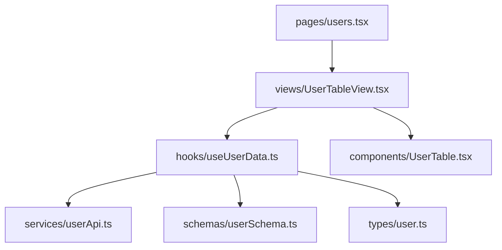

# Feature Data Flow

## 回推資料流主線




## features 資料流的完整層次結構

```
→ index.ts          [對外導出入口]
  → views/          [組合 hook + component]
    → hooks/        [邏輯與狀態]
      → services/   [資料來源]
      → schemas/    [資料驗證與轉換]
      → types/      [型別參照]
    → components/   [UI 呈現]
```

## 重構作業流程

<!-- View 渲染流建立 -->
1. views的檔案匯出(空殼)，在index.ts中集成後匯出，在pages中組裝
2. components檔案匯出(空殼)，views集成components

<!-- Component 設計、串接 -->
3. 設計components(組裝@/components，非共用不需要從@/components匯入)
4. 設計hooks，輸出假資料
5. views集成hooks，與components串接

<!-- Hook 設計、組裝 -->
6. 設計services, schemas, types
7. hooks(組裝services, schemas, types)

## 驗收標準
### 🧱 第一階段：View Shell 建構 - `1`, `2`
對應步驟：views 匯出空 div → index.ts 匯出 → pages 組裝

驗收標準：<br/>
✅ 所有 views 僅定義空容器（不可含邏輯與樣式）<br/>
✅ index.ts 僅暴露 views，未暴露其他內部結構<br/>
✅ pages 能正常組裝並渲染對應空殼 View<br/>
✅ 整體路由與模組命名一致，結構清晰、可預期<br/>

### 🧩 第二階段：Component 與邏輯組裝 - `3`, `4`, `5`
目的：建構場景邏輯與視覺層連接，建立 mock 資料流

驗收標準：<br/>
✅ components 可獨立測試呈現，未耦合資料邏輯<br/>
✅ hooks 輸出假資料與事件函式，資料結構明確<br/>
✅ views 成功整合 hooks 與 components，建立展示資料流<br/>
✅ 不可出現 hooks 呼叫 service，或 views 呼叫 service（責任分離）<br/>

### 🧷 第三階段：邏輯底層封裝與資料串接 - `6`, `7`
目的：替換假資料為實際 service 資料源，實現模組內聚

驗收標準：<br/>
✅ services 封裝 API 呼叫，並實作錯誤處理<br/>
✅ schemas 定義清晰（使用 zod/yup），支援驗證與轉換<br/>
✅ types 單獨維護，確認無定義 types 於其他檔案<br/>
✅ hooks 僅組裝 service/schemas/types，無副作用外洩<br/>
✅ 全部資料流均透過 props 往上傳遞，不直接操作外部狀態<br/>


## SSR作業流程
1. features設計初始化loaders(組裝hooks)
2. loaders於index.ts中集成後匯出
3. SSR渲染
    - pages移除use client，請求loaders初始化函數，作為props傳輸到
    - views新增props, 接收pages初始化資料


## 注意事項
- 當types需要被兩個以上features引用時，需抽離到 project-root/types